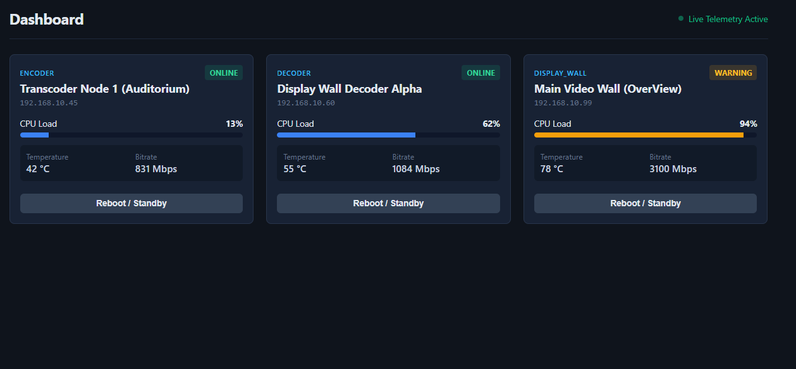

# Real-Time Dashboard

<!-- [](https://angular.dev/)
[](https://www.typescriptlang.org/)
[](https://rxjs.dev/)
[](#automated-testing) -->

<!-- A basic real-time frontend monitoring dashboard. The dashboard visualizes streaming hardware telemetry (CPU load, temperature, network bitrate) across distributed nodes (encoders, decoders, video walls) and enables live operational controls with optimistic state updates.

---

## Preview



---

## Key Features

- **Live Telemetry Streams:** Periodic metrics drift emulating hardware sensor pushes via reactive RxJS streams (`BehaviorSubject` + `interval`).
- **Dynamic State Evaluation:** Automatic status recalculation (`ONLINE` -> `WARNING`) when thermal thresholds or CPU bounds are breached.
- **Node Power & Standby Controls:** Direct hardware state toggling with instant local state updates.
- **Strict Domain Modeling:** Compile-time type safety over hardware states using TypeScript union types and interfaces.
- **Automated Test Coverage:** Unit test suites verifying asynchronous state toggling and DOM title rendering.

--- -->

<!-- 
## project tree
ts-dashboard
├─ .angular
│  └─ cache
│     └─ 22.1.8
│        └─ ts-dashboard
│           ├─ .tsbuildinfo
│           └─ vite
│              └─ deps
│                 ├─ @angular_core.js
│                 ├─ @angular_platform-browser.js
│                 ├─ @angular_router.js
│                 ├─ @angular_router.js.map
│                 ├─ core-Gi4yMOCN.js
│                 ├─ core-Gi4yMOCN.js.map
│                 ├─ package.json
│                 ├─ platform-browser-Dkr8FYga.js
│                 ├─ platform-browser-Dkr8FYga.js.map
│                 └─ _metadata.json
├─ .editorconfig
├─ .prettierrc
├─ angular.json
├─ docs
│  └─ dashboard_preview.png
├─ package-lock.json
├─ package.json
├─ public
│  └─ favicon.ico
├─ README.md
├─ src
│  ├─ app
│  │  ├─ app.config.ts
│  │  ├─ app.css
│  │  ├─ app.html
│  │  ├─ app.routes.ts
│  │  ├─ app.spec.ts
│  │  ├─ app.ts
│  │  ├─ models
│  │  │  └─ device.model.ts
│  │  └─ services
│  │     ├─ device.spec.ts
│  │     └─ device.ts
│  ├─ index.html
│  ├─ main.ts
│  └─ styles.css
├─ tsconfig.app.json
├─ tsconfig.json
└─ tsconfig.spec.json
# orginal:
## TsDashboard

This project was generated using [Angular CLI](https://github.com/angular/angular-cli) version 22.1.8.

### Development server

To start a local development server, run:

```bash
ng serve
```

Once the server is running, open your browser and navigate to `http://localhost:4200/`. The application will automatically reload whenever you modify any of the source files.

### Code scaffolding

Angular CLI includes powerful code scaffolding tools. To generate a new component, run:

```bash
ng generate component component-name
```

For a complete list of available schematics (such as `components`, `directives`, or `pipes`), run:

```bash
ng generate --help
```

### Building

To build the project run:

```bash
ng build
```

This will compile your project and store the build artifacts in the `dist/` directory. By default, the production build optimizes your application for performance and speed.

### Running unit tests

To execute unit tests with the [Vitest](https://vitest.dev/) test runner, use the following command:

```bash
ng test
```

### Running end-to-end tests

For end-to-end (e2e) testing, run:

```bash
ng e2e
```

Angular CLI does not come with an end-to-end testing framework by default. You can choose one that suits your needs.

### Additional Resources

For more information on using the Angular CLI, including detailed command references, visit the [Angular CLI Overview and Command Reference](https://angular.dev/tools/cli) page. -->
